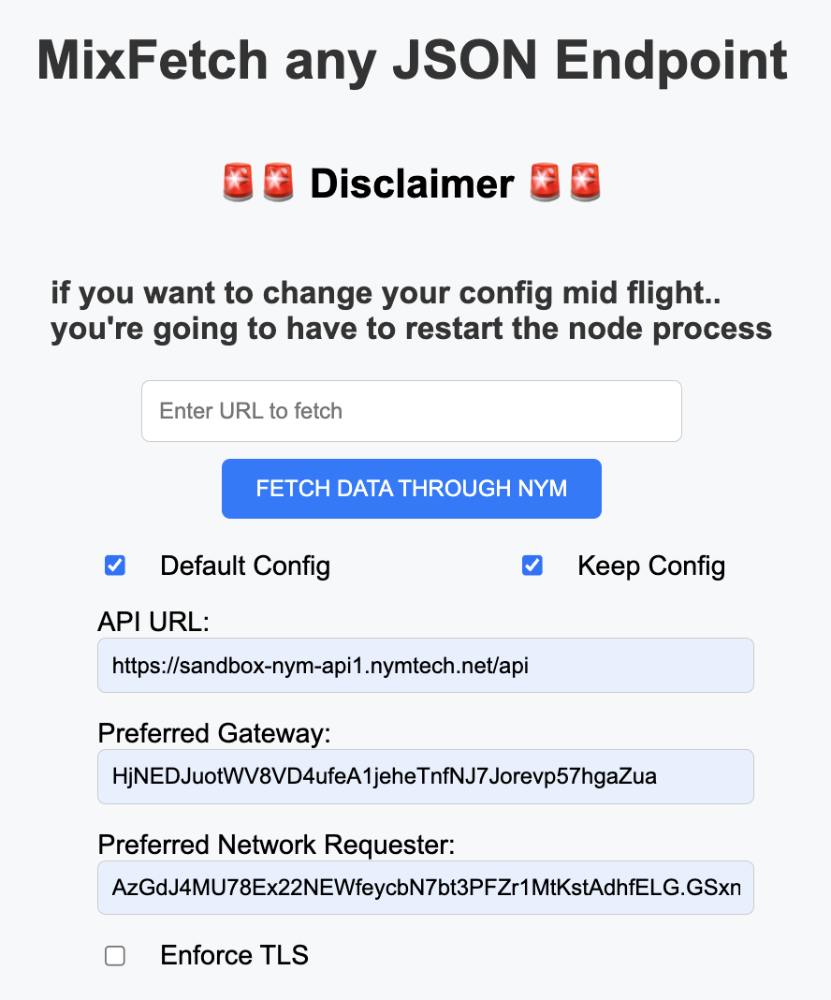
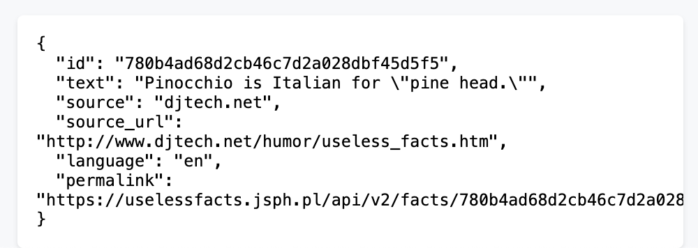

# Node.js MixFetch

Welcome to Node.js MixFetch, your straightforward and efficient solution for fetching JSON data! Follow these simple steps to get started:

## Quick Setup Instructions:

1. **Install Dependencies**: Run `yarn install` in your terminal.
2. **Start the Application**: Execute `yarn start` to get things rolling.
3. **Access the Application**: Open your preferred web browser and navigate to [http://localhost:3000](http://localhost:3000).
4. **Fetch Data**: Input any URL that returns JSON data. Here are some points to remember:
    - **Note of Caution**: This application has not undergone extensive testing with non-JSON endpoints. Entering a URL that doesn't return JSON data is at your own risk.
    - **Default Configuration**: In the absence of a provided configuration, MixFetch will default to a mainnet setup, randomly selecting a gateway and network requester. These have built-in filter lists, limiting queries to specific APIs.
    - **Configuration Persistence**: Desire a custom setup? Input your preferred configuration and select the option to keep the configuration even after restarting the node app.

## See the Magic:

Watch the output come alive on your screen.

## Some Fun Endpoints to Try:

- Get a random fact: [https://uselessfacts.jsph.pl/random.json?language=en](https://uselessfacts.jsph.pl/random.json?language=en)
- Explore Nym validator nodes: [https://validator.nymtech.net/api/v1/mixnodes](https://validator.nymtech.net/api/v1/mixnodes)
- Search for 'nym' on CoinGecko: [https://api.coingecko.com/api/v3/search?query=nym](https://api.coingecko.com/api/v3/search?query=nym)

Happy Data Fetching! 🚀

Returns:

